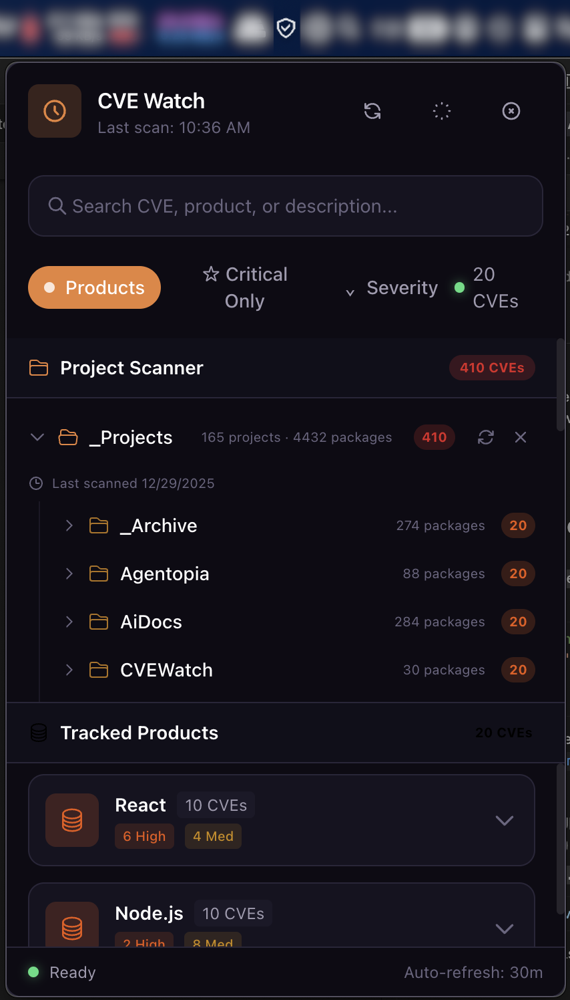

# CVE Watch

A beautiful, native-feeling macOS menu bar app that tracks CVEs for specific products you care about.



## Features

- 🔍 **Product-specific tracking** — Choose exactly which technologies to monitor (React, PostgreSQL, nginx, etc.)
- 🎨 **Native macOS feel** — Vibrancy effects, SF Pro typography, smooth animations
- 🌓 **Automatic theme switching** — Seamlessly follows your system appearance
- 🔔 **Critical CVE alerts** — Get notified about high-severity vulnerabilities
- ⚡ **Background polling** — Configurable interval to check for new CVEs
- 📦 **100+ products** — Pre-configured list across 13 categories

## Tech Stack

- **Electron** — Cross-platform desktop framework
- **React** — UI library
- **Tailwind CSS** — Utility-first styling
- **Framer Motion** — Buttery smooth animations
- **NVD API v2.0** — Official CVE data source
- **electron-store** — Persistent preferences
- **SQLite** — Local CVE cache (planned)

## Development

### Prerequisites

- Node.js 18+
- npm or yarn

### Install dependencies

```bash
npm install
```

### Run in development mode

```bash
npm run dev
```

This starts both the Vite dev server and Electron in parallel.

### Build for production

```bash
npm run build
```

This creates a distributable `.dmg` in the `dist/` folder.

## Configuration

CVE Watch stores preferences using `electron-store`:

- **Products** — List of technologies to track
- **Poll Interval** — How often to check for new CVEs (15min - 6hr)
- **Notifications** — Enable/disable critical CVE alerts
- **Theme** — System, Light, or Dark

## NVD API Usage

This app uses the [NVD API v2.0](https://nvd.nist.gov/developers/vulnerabilities) to fetch CVE data.

**Rate Limits:**
- Without API key: 5 requests per 30 seconds
- With API key: 50 requests per 30 seconds

To use an API key, add it to your preferences or set the `NVD_API_KEY` environment variable.

## Project Structure

```
CVEWatch/
├── electron/           # Electron main process
│   ├── main.js         # Main entry, tray, window management
│   └── preload.js      # Context bridge for IPC
├── src/
│   ├── components/     # React components
│   ├── contexts/       # React contexts (Theme, Preferences, CVE)
│   ├── data/           # Static data (products list)
│   ├── services/       # API services (NVD)
│   └── styles/         # Global CSS
├── assets/             # App icons, tray icons
└── package.json
```

## Security

CVE Watch implements several security measures:

- **Content Security Policy (CSP)** — Strict CSP headers prevent XSS attacks
- **Context Isolation** — Renderer process is sandboxed from Node.js APIs
- **Input Validation** — All user inputs and API responses are validated
- **DOMPurify Sanitization** — All external content is sanitized before rendering
- **Rate Limiting** — IPC calls are rate-limited to prevent abuse
- **HTTPS Only** — All external connections use HTTPS
- **Path Validation** — File system access is restricted to user directories
- **Symlink Protection** — Symlink chains are limited to prevent escape attacks

### Known Limitations

- **CSP `unsafe-inline` for styles** — Required for Tailwind CSS. XSS is mitigated by DOMPurify sanitization of all external content.

### Security Notes for Developers

- **Never share debug logs publicly** — Debug logs (only generated in development mode) may contain file paths and system information
- **Run `npm audit` regularly** — Check for dependency vulnerabilities before releases (use `npm run audit`)
- **Test security warnings** — Run with `app.commandLine.appendSwitch('enable-logging')` to see Electron security warnings

### Reporting Vulnerabilities

If you discover a security vulnerability, please report it privately to the author rather than opening a public issue.

## License

This project is not licensed for use. All rights reserved. No usage, copying, modification, or distribution permitted without explicit written permission from the author.

## Acknowledgments

- [National Vulnerability Database (NVD)](https://nvd.nist.gov/) for CVE data
- [Electron](https://www.electronjs.org/) for the framework
- [Tailwind CSS](https://tailwindcss.com/) for styling utilities

